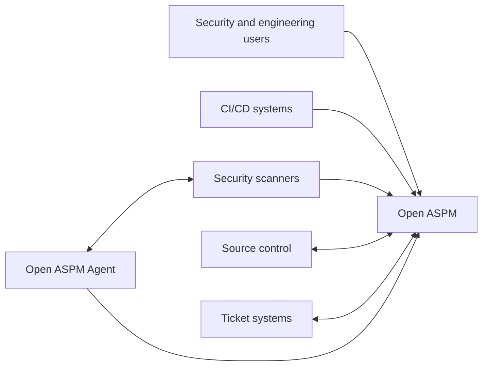
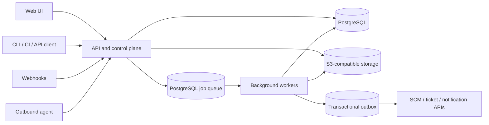
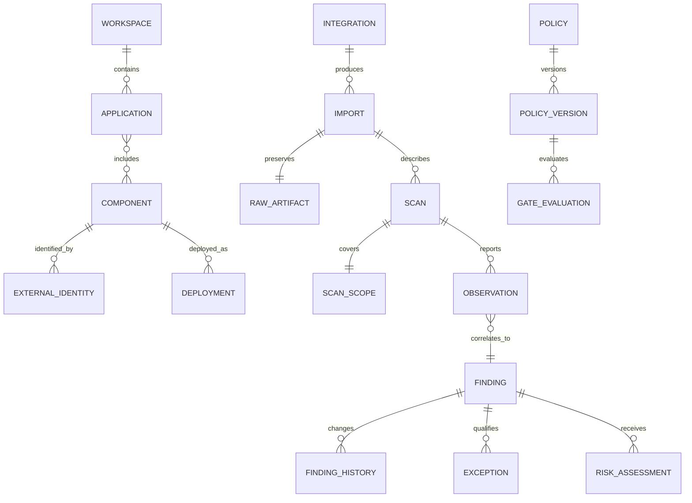
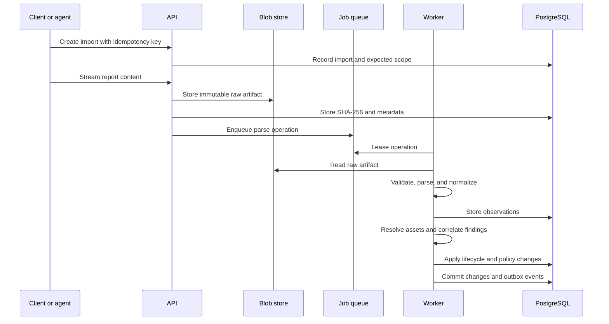

# Open ASPM Architecture

## Status

This document describes the intended architecture of Open ASPM. It is a design
baseline, not a compatibility promise. Significant decisions must be recorded
as Architecture Decision Records (ADRs) before their implementation is treated
as stable.

Related design documents:

- [Domain glossary](../glossary.md)
- [Architecture Decision Records](../adr/README.md)
- [System threat model](../threat-model/system.md)
- [Test data policy](../testing/test-data-policy.md)
- [Ingestion API v1 contract](../api/ingestion-v1.md)
- [BlobStore implementation](../storage/blobstore.md)
- [SARIF parsing](../parsing/sarif.md)

Open ASPM is currently pre-alpha. The first goal is a trustworthy vertical
slice from report ingestion to an explainable finding, not a broad collection
of partially implemented integrations.

## Design principles

1. **Preserve source evidence.** Imported evidence is immutable and remains
   distinguishable from normalized or enriched data.
2. **Prefer deterministic behavior.** Identity, correlation, state transitions,
   and policy decisions must be reproducible and versioned.
3. **Keep the server authoritative.** Lifecycle, correlation, policy, and access
   control remain server-side. Clients and agents are thin.
4. **Treat all integrations as untrusted.** Reports, webhooks, connector APIs,
   and agent output cross a trust boundary.
5. **Start operationally simple.** A modular monolith and PostgreSQL are the
   default. Components are extracted only in response to measured constraints.
6. **Support small and large installations.** A single-node deployment must not
   require an enterprise message bus or search cluster.
7. **Make security decisions explainable.** Effective severity, risk, policy,
   and gate results retain their inputs and algorithm versions.
8. **Version external contracts.** APIs, ingestion schemas, fingerprints,
   parsers, normalization, and policies evolve explicitly.

## System context



Open ASPM aggregates and manages security posture. It does not replace SAST,
SCA, DAST, secret, container, cloud, or infrastructure scanners.

## Deployment architecture

The initial implementation is a modular Go application delivered as one
binary with several runtime modes:

```text
open-aspm server
open-aspm worker
open-aspm agent
open-aspm migrate
```

Small installations may run server and worker in one process. Production
deployments can run them as independently scaled processes without changing
domain boundaries.



### Initial technology choices

| Concern | Initial choice |
| --- | --- |
| Backend | Go |
| Public API | REST/JSON described by OpenAPI 3.1 |
| Transactional store | PostgreSQL |
| Background jobs | PostgreSQL leases using `FOR UPDATE SKIP LOCKED` |
| Domain event delivery | Transactional outbox |
| Raw report storage | S3-compatible API; filesystem adapter for development |
| Web application | React and TypeScript |
| Authentication | OIDC and scoped service tokens |
| Policy expressions | A typed, sandboxed expression language such as CEL |
| Telemetry | OpenTelemetry traces, metrics, and structured logs |
| Local deployment | Docker Compose |
| Cluster deployment | Helm, after the single-node contract is stable |

Kafka, NATS, Redis, OpenSearch, and a graph database are not initial
dependencies. PostgreSQL remains the source of truth. Search engines and
analytics stores may later be introduced as disposable projections.

## Logical modules

The modular monolith is divided into bounded contexts. Modules communicate
through application interfaces and domain events, not direct writes to each
other's tables.

| Module | Responsibility |
| --- | --- |
| Identity | Users, service accounts, sessions, OIDC, and API tokens |
| Tenancy | Workspaces, membership, roles, and authorization boundaries |
| Catalog | Applications, components, repositories, artifacts, deployments, and ownership |
| Integrations | Connector configuration, credentials references, health, and scheduling |
| Ingestion | Upload sessions, idempotency, raw artifacts, imports, and scan metadata |
| Parsing | Versioned adapters for SARIF, CycloneDX, and vendor formats |
| Findings | Observations, Findings, opaque Finding IDs, technical lifecycle, and history |
| Correlation | Deterministic fingerprints, aliases, grouping, and duplicate relations |
| Intelligence | Vulnerability records, aliases, affected ranges, and enrichment snapshots |
| Risk | Versioned risk calculations with explainable factors |
| Policy | Policy versions, evaluations, exceptions, and Security Gates |
| Workflow | Triage, assignment, remediation state, comments, and external tickets |
| Audit | Append-only records of security-relevant actions |
| Projection | Query models, dashboards, trends, and export views |
| Notification | Webhooks and user-facing notifications delivered through the outbox |

Package boundaries should be enforceable in tests and code review. A later
service split, if ever required, should follow these boundaries.

## Core domain model



### Observation versus finding

An **Observation** is an immutable statement made by a particular tool in a
particular scan. It preserves source severity, location, identifiers, evidence,
and tool metadata.

A **Finding** is the correlated issue managed by Open ASPM. It can be assigned,
triaged, accepted, resolved, or reopened and may be supported by many
observations.

This separation prevents repeated scans from creating unrelated findings while
retaining a complete evidence trail.

### Independent state dimensions

A single `status` field is insufficient. At minimum, Open ASPM separates:

```text
Technical lifecycle: detected | present | absent | reopened
Triage disposition: unknown | confirmed | false_positive | accepted_risk | duplicate
Workflow state:      new | assigned | in_progress | ready_for_verification | closed
```

For example, a finding may remain technically present while its accepted-risk
exception makes its workflow state closed.

## Asset identity

Names and URLs are mutable and must not be primary identities. The catalog uses
provider IDs and identity history to survive repository renames, organization
transfers, forks, monorepos, mutable container tags, and redeployments.

```text
ExternalIdentity
  workspace_id
  provider
  object_type
  external_id
  canonical_url
  valid_from
  valid_until
```

Artifacts use immutable identities such as a container digest or content hash
where available. Relationships between applications, components, repositories,
artifacts, and deployments are explicit rather than inferred from display
names.

## Ingestion pipeline



Every stage is idempotent. Import handlers use stable operation keys and may be
retried after a crash without duplicating observations or lifecycle events.

### Scan scope and absence semantics

A missing observation does not automatically mean that a finding was fixed.
Every scan records its scope and completeness:

```text
ScanScope
  application
  component
  repository
  branch
  commit
  artifact_digest
  scanner
  scanner_configuration_hash
  scan_type
  coverage
  completeness: full | partial | incremental
```

A previous finding may transition to `absent` only when a successful,
authoritative scan covered a compatible scope. Partial, incremental, cancelled,
or failed scans cannot close findings merely by omission.

## Correlation

Initial correlation is deterministic rather than probabilistic. Example inputs
include:

```text
SAST:      repository identity + rule + normalized path + code context
SCA:       artifact/component + package URL + vulnerability identity
Container: image digest + package URL + vulnerability identity
DAST:      deployment + normalized route + parameter + rule
Secret:    repository identity + secret type + location fingerprint
```

Each stored fingerprint includes an algorithm name and version. Changing an
algorithm creates an explicit migration or alias; it never silently changes
Finding membership or replaces opaque Finding IDs.

Machine-learning or fuzzy correlation may later propose relationships, but it
must not silently merge findings without an explainable decision and an audit
record.

## Provenance and enrichment

Source facts remain separate from computed facts. Records retain, where
applicable:

```text
source
source_object_id
scanner_name
scanner_version
scanner_ruleset_version
parser_version
normalization_version
fingerprint_version
content_sha256
observed_at
received_at
```

Severity is represented as distinct values rather than overwritten:

```text
source_severity
normalized_severity
effective_severity
effective_severity_reason
```

Vulnerability intelligence is imported as versioned snapshots. Risk
assessments preserve their input snapshot, algorithm version, score, and
explainable factors so historical decisions remain reproducible.

## Policy and Security Gates

A Security Gate is an immutable evaluation, not a mutable Boolean field:

```text
GateEvaluation
  policy_version
  subject_type
  subject_id
  branch
  commit
  pull_request
  environment
  decision: passed | failed | warning | unknown
  reasons[]
  metrics_snapshot
  evaluated_at
```

Users must be able to determine which rule failed, which findings contributed,
what exceptions applied, and which data versions were evaluated.

## Authentication and authorization

All root records carry a `workspace_id`, including compound uniqueness and
foreign-key constraints. Application authorization is mandatory; PostgreSQL
Row Level Security may be added as defense in depth.

The initial RBAC model should cover at least:

```text
viewer
analyst
developer
application_owner
security_manager
workspace_admin
```

API tokens are random, scoped credentials whose plaintext is shown once and is
never stored. Integration secrets are accessed through a `SecretStore`
interface. Database records contain secret references, not retrievable
credentials.

## Agent security model

Agents provide access to scanners and services inside restricted networks.
They establish outbound connections only and use:

- explicit enrollment and workspace binding;
- unique agent identity and short-lived credentials or mTLS;
- capability-scoped job leases;
- replay protection and operation idempotency;
- destination allowlists and per-job credential references;
- heartbeat, revocation, and auditable execution;
- signed, controlled software updates.

An agent never receives every credential in a workspace and does not make
server-side authorization or policy decisions.

## Untrusted content handling

Reports and integration payloads may be malicious. The ingestion boundary
enforces:

- compressed and uncompressed size limits;
- streaming parsing and bounded recursion;
- CPU, memory, and wall-clock deadlines;
- safe archive extraction and path validation;
- disabled XML external entities;
- content-type and encoding validation;
- output escaping for evidence displayed in the UI;
- redaction controls for credentials and personal data;
- process, container, or WASM isolation for third-party parsers.

Raw artifacts are never rendered directly in a privileged browser context.

## Background job semantics

The PostgreSQL queue supports the following lifecycle:

```text
queued -> leased -> running -> succeeded
                      |-----> retry_wait -> queued
                      |-----> dead_letter
```

Jobs have lease expiry, heartbeat, bounded retries, exponential backoff,
cancellation, concurrency limits, and dead-letter inspection. A worker crash
must not permanently own a job.

## Query and analytics model

Transactional tables remain authoritative, but dashboards use explicit read
projections such as:

```text
application_posture_summary
finding_counts_by_severity
sla_status
gate_status
risk_trend_by_day
integration_health
```

Projections are rebuildable from authoritative data. OpenSearch or an analytics
database may later accelerate queries but does not become the only copy of
security state.

## Data lifecycle

Retention policies independently cover raw reports, observations, finding
history, audit records, and analytics projections. The architecture must also
support workspace export, deletion, legal hold, secret erasure, and consistent
backup and restore of PostgreSQL and blob storage.

Database migrations are forward-only and versioned. Compatibility rules cover
server, worker, agent, public API, ingestion schema, and stored data versions.

## Standards and interchange

Initial ingestion targets are:

- the versioned Open ASPM ingestion contract;
- SARIF 2.1.0 for static-analysis-style results;
- CycloneDX for component, dependency, vulnerability, and VEX data;
- vendor-specific adapters when no stable standard representation exists.

Interchange standards are adapter contracts, not the internal domain model.
The original document is retained even after successful normalization.

## Repository structure

```text
api/
  openapi.yaml
cmd/
  open-aspm/
internal/
  asset/
  audit/
  auth/
  catalog/
  correlation/
  finding/
  ingestion/
  integration/
  intelligence/
  policy/
  queue/
  risk/
  storage/
  tenancy/
  worker/
pkg/
  connector/
  ingestion/
web/
migrations/
deploy/
  compose/
  helm/
docs/
  architecture/
  adr/
  threat-model/
testdata/
  sarif/
  cyclonedx/
  vendor/
```

Public packages are introduced only for intentionally supported extension
contracts. Most implementation code remains under `internal/` until the API is
stable.

## Delivery sequence

1. Threat model and trust boundaries.
2. Domain terminology, invariants, and ADRs.
3. Workspace identity and authorization.
4. Application, component, and external identity catalog.
5. Raw artifact, import, scan, and scan-scope model.
6. PostgreSQL job leasing and transactional outbox.
7. One complete SARIF ingestion path.
8. Observation, deterministic correlation, and finding lifecycle.
9. Audit log and read projections.
10. Minimal findings UI and API.
11. Versioned policy and Security Gate evaluation.
12. CycloneDX ingestion and vulnerability intelligence.
13. External connectors and the outbound agent.

The first milestone is complete only when one report can be safely ingested,
traced to immutable evidence, correlated into stable findings, queried through
the API, and processed repeatedly without changing the result.

## Explicitly deferred

The following are intentionally outside the first milestone:

- microservice decomposition;
- Kafka or another mandatory external message bus;
- a mandatory search or graph database;
- arbitrary in-process plugins;
- machine-learning correlation;
- scanner orchestration;
- a public connector marketplace;
- unsupported compliance claims.

Deferral keeps the initial security boundary understandable and the open-source
deployment accessible while preserving extension points for measured needs.
