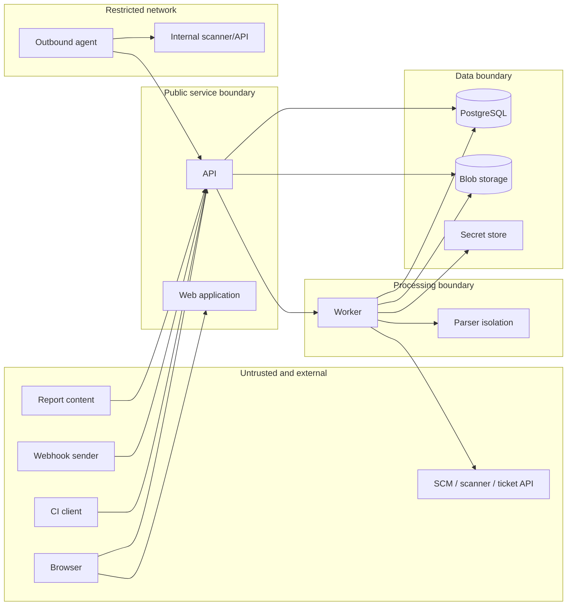

# Open ASPM System Threat Model

## Status and scope

- **Status:** Initial design threat model
- **Last reviewed:** 2026-09-22
- **Applies to:** intended Open ASPM architecture

Open ASPM is pre-alpha. Controls in this document are requirements unless an
implementation and verification reference is provided. Their presence here
must not be interpreted as evidence that they are already implemented.

This model covers the API, web application, workers, PostgreSQL, raw artifact
storage, CI clients, webhooks, outbound agents, and external integrations. It
does not claim to assess the internal security of third-party scanners or
identity providers.

## Security objectives

1. Prevent one workspace from reading or modifying another workspace's data.
2. Preserve the integrity and provenance of imported security evidence.
3. Prevent untrusted reports and connector responses from compromising the
   platform or a user's browser.
4. Restrict credentials to the minimum component and operation that requires
   them.
5. Make privileged and security-relevant actions attributable and auditable.
6. Keep ingestion failures and malicious inputs from making the service
   unavailable to other workspaces.
7. Make policy, correlation, and lifecycle decisions reproducible.

## Protected assets

| Asset | Security concern |
| --- | --- |
| Scanner reports and evidence | May contain proprietary code, URLs, secrets, and vulnerability details |
| Findings and exceptions | Integrity affects remediation and delivery decisions |
| Integration credentials | Can grant access to source control, scanners, clouds, and ticket systems |
| User and service identities | Control access across the platform |
| Policy and Gate results | Integrity may permit or block software delivery |
| Audit records | Must remain attributable and resistant to unauthorized modification |
| Agent identity | Grants controlled access from restricted networks |
| Availability | Ingestion must remain usable despite malformed or high-volume input |

## Actors

| Actor | Description |
| --- | --- |
| Workspace user | Legitimate user with one or more scoped roles |
| Workspace administrator | User allowed to manage membership and integrations |
| CI service account | Automated client that uploads evidence or requests Gate evaluation |
| Open-source contributor | Supplies code, dependencies, tests, or documentation |
| External system | SCM, scanner, identity provider, ticket system, or notification service |
| Agent operator | Installs an agent in a restricted network |
| Malicious unauthenticated actor | Attempts remote compromise or resource exhaustion |
| Malicious or compromised member | Has legitimate access to a limited workspace or application scope |
| Compromised external system | Sends malicious data or abuses stored credentials |
| Supply-chain attacker | Attempts to compromise dependencies, releases, build jobs, or updates |

## Trust boundaries

Every arrow that crosses a boundary requires authenticated identity where
applicable, authorization, input validation, resource limits, safe error
handling, and telemetry without sensitive payloads.

## Assumptions

- Deployment operators protect host, cluster, database, and object-store
  administrator access.
- TLS termination is correctly configured and internal plaintext transport is
  not exposed to untrusted networks.
- Identity providers authenticate users correctly; Open ASPM remains
  responsible for authorization.
- A workspace administrator is trusted to grant access within that workspace,
  but not to bypass other workspaces.
- Scanner results are never trusted merely because they came from an
  authenticated integration.

## Threats and required controls

### TM-01: Cross-workspace data access

**Threat:** An identifier, filter, relationship, cache key, or background job is
used without workspace scope, exposing or modifying another workspace's data.

**Required controls:**

- Put `workspace_id` on tenant-owned roots and relevant compound keys.
- Resolve workspace from authenticated context, not request-body claims.
- Authorize before repository queries and object-store URL generation.
- Include workspace scope in jobs, idempotency keys, projections, and caches.
- Add negative integration tests using valid identifiers from another
  workspace.
- Consider PostgreSQL Row Level Security as defense in depth.

### TM-02: Broken object-level authorization

**Threat:** A valid workspace member accesses an application, integration,
finding, exception, or credential outside their assigned scope.

**Required controls:**

- Centralize capability checks in application services.
- Avoid UI-only access restrictions.
- Define role-to-capability tests for every write operation.
- Audit authorization failures without leaking resource details.

### TM-03: Malicious report parsing

**Threat:** Crafted JSON, XML, archives, encodings, or deeply nested structures
cause code execution, file access, excessive allocation, or CPU exhaustion.

**Required controls:**

- Stream uploads and parsing where supported.
- Enforce compressed and uncompressed byte limits.
- Bound nesting, collection counts, strings, locations, and code-flow length.
- Disable XML external entities and unsafe object deserialization.
- Normalize and validate archive paths before extraction.
- Apply CPU, memory, and wall-clock deadlines.
- Isolate third-party parsers in a process, container, or WASM sandbox.
- Preserve the raw artifact for diagnosis without rendering it.

### TM-04: Stored browser injection

**Threat:** Scanner messages, evidence, URLs, Markdown, or source snippets
execute script or inject privileged UI content.

**Required controls:**

- Treat imported text as plain text by default.
- Use contextual output encoding and a restrictive Content Security Policy.
- Sanitize any explicitly supported rich-text subset.
- Never render raw reports in the application's privileged origin.
- Test common HTML, SVG, URL, and Markdown payloads.

### TM-05: SSRF through integrations

**Threat:** A user or compromised connector causes server or agent requests to
metadata services, loopback, internal control planes, or unrelated networks.

**Required controls:**

- Validate schemes, hosts, ports, redirects, and resolved addresses.
- Reject link-local, loopback, multicast, and prohibited private ranges unless
  an explicit deployment policy allows them.
- Revalidate after DNS resolution and redirect.
- Apply destination allowlists to agents and high-trust integrations.
- Use network egress policy as defense in depth.

### TM-06: Credential disclosure

**Threat:** Integration secrets leak through database reads, APIs, logs, error
messages, job payloads, exports, support bundles, or browser responses.

**Required controls:**

- Store secret references rather than plaintext in domain tables.
- Expose credentials only to the connector operation that requires them.
- Never return an existing secret value through read APIs.
- Redact structured logs, traces, errors, and audit details.
- Support credential rotation and revocation.
- Store API-token verifiers rather than retrievable token plaintext.

### TM-07: Webhook forgery and replay

**Threat:** An attacker submits forged or repeatedly delivered webhook events
to create imports, change state, or exhaust resources.

**Required controls:**

- Verify provider signatures using the exact received bytes.
- Enforce timestamp windows where the provider protocol supports them.
- Deduplicate provider delivery identifiers within workspace and integration.
- Apply rate, size, and concurrency limits before expensive processing.
- Do not log signature headers or secret material.

### TM-08: Import replay and identity collision

**Threat:** Repeated requests create duplicate observations or findings, while
weak idempotency scope causes unrelated imports to overwrite each other.

**Required controls:**

- Scope idempotency keys by workspace, client identity, and operation type.
- Verify repeated request parameters and content digest match the original.
- Make every processing stage idempotent.
- Version fingerprints and preserve collision evidence.
- Never silently merge ambiguous finding identities.

### TM-09: Incorrect finding closure

**Threat:** A failed, partial, incremental, or differently scoped scan omits a
finding and incorrectly marks it fixed.

**Required controls:**

- Store explicit scan scope, completeness, result, and configuration identity.
- Reconcile only successful authoritative scans with compatible scope.
- Preserve lifecycle transition evidence and allow deterministic replay.
- Test absence behavior independently for every scan type.

### TM-10: Background job abuse and starvation

**Threat:** Poison messages, retry storms, oversized tenants, or expired leases
consume all workers and block other work.

**Required controls:**

- Use bounded retries, exponential backoff, and dead-letter state.
- Apply workspace quotas and fair scheduling or reserved capacity.
- Recover expired leases without concurrent successful completion.
- Separate retryable infrastructure failures from permanent input failures.
- Expose queue age, attempt count, lease expiry, and saturation metrics.

### TM-11: Compromised outbound agent

**Threat:** A stolen agent credential or compromised host requests unrelated
jobs, reads broad credentials, replays output, or impersonates another agent.

**Required controls:**

- Give every agent a unique, revocable identity bound to one workspace.
- Use short-lived credentials or mTLS after explicit enrollment.
- Issue capability-scoped job leases and destination allowlists.
- Bind result submission to agent, job, attempt, and lease identity.
- Never send all workspace credentials to an agent.
- Sign releases and define a controlled update mechanism.

### TM-12: Compromised external integration

**Threat:** An authenticated external service sends malicious or misleading
data, or its token is used to perform unexpected actions.

**Required controls:**

- Grant least-privilege provider scopes.
- Separate read-only ingestion from write-back capabilities.
- Preserve source provenance and connector version.
- Require explicit configuration for external mutations such as ticket
  creation or pull-request comments.
- Rate-limit and audit connector actions.

### TM-13: Policy and Gate manipulation

**Threat:** An unauthorized user changes a policy, exception, input projection,
or historical Gate result to permit a release.

**Required controls:**

- Version policies and make evaluations immutable.
- Separate permission to triage findings from permission to approve exceptions.
- Record actor, reason, expiry, subject, and policy version for exceptions.
- Sign or otherwise bind CI responses to the requested subject and commit.
- Audit policy publication and exception lifecycle.

### TM-14: Audit tampering or information leakage

**Threat:** Privileged actions are removed from audit history, or audit events
become another source of credentials and sensitive report content.

**Required controls:**

- Make application-level audit records append-only.
- Restrict audit access separately from normal finding access.
- Record identifiers and outcomes rather than unrestricted payloads.
- Export to operator-controlled immutable storage where required.
- Monitor audit delivery failures.

### TM-15: Dependency and build compromise

**Threat:** A malicious dependency, build action, maintainer account, or release
pipeline produces compromised Open ASPM binaries or images.

**Required controls:**

- Pin CI actions and verify dependency checksums.
- Require protected-branch review and successful checks.
- Minimize workflow permissions and isolate untrusted pull-request code from
  secrets.
- Produce SBOMs and signed provenance for releases.
- Sign release artifacts and publish verification instructions.
- Use reproducible or independently verifiable builds where feasible.

### TM-16: Backup, retention, and deletion failure

**Threat:** Sensitive data survives promised deletion, or inconsistent database
and blob backups make evidence unrecoverable or incorrectly linked.

**Required controls:**

- Define separate retention for raw artifacts, observations, audit, and
  projections.
- Coordinate database and blob-store backup points.
- Test restore, workspace deletion, secret erasure, and legal hold.
- Make backup access at least as restrictive as production data access.

## Abuse and availability limits

The public API must define limits for:

- upload bytes and expansion ratio;
- requests and concurrent imports per identity and workspace;
- observations, locations, flows, and evidence bytes per import;
- job runtime, memory, attempts, and total retry duration;
- pagination size and query complexity;
- webhook delivery size and replay window;
- outbound response size and redirect count.

Limits must fail explicitly and produce safe diagnostic information. Silent
truncation is allowed only where the response records that truncation occurred
and preserves the original artifact.

## Validation strategy

The security test plan should include:

- cross-workspace and cross-application authorization matrices;
- parser fuzzing and malicious fixture corpora;
- archive, encoding, recursion, and decompression-limit tests;
- stored browser injection tests;
- SSRF tests including redirects and DNS rebinding simulations;
- webhook forgery, replay, and deduplication tests;
- worker crash and retry-storm tests;
- finding reconciliation tests for every scan completeness state;
- agent enrollment, expiry, revocation, and result-binding tests;
- backup/restore and deletion exercises.

## Residual risks and open questions

- The initial parser isolation mechanism has not been selected.
- The initial OIDC provider compatibility profile is not yet defined.
- Deployment-level network-policy requirements need environment-specific
  guidance.
- Formal audit immutability and external archival are deployment-dependent.
- Provider-specific SSRF requirements may conflict with intentional access to
  private scanner endpoints and need explicit operator policy.
- The project needs a release threat model once CI and packaging are selected.
